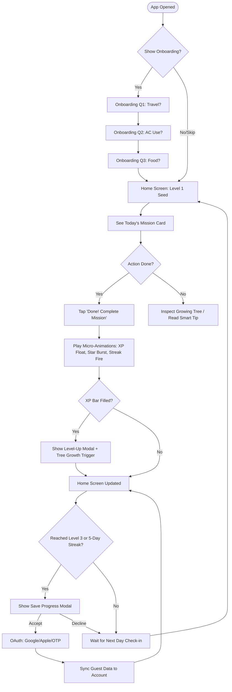

# Green Hero: UX Blueprint

This document houses the strategic UX architecture for **Green Hero**, establishing the target audience profiles, journey phases, navigational structure, and user logic flows.

---

## 1. User Personas

To design for mass adoption, we create four core personas spanning various ages, technical literacies, and socio-economic environments.

### Persona 1: The Elderly Traditionalist
*   **Name**: Ramesh Prasad, 67
*   **Location**: Semi-urban (Tier 2 City)
*   **Role**: Retired School Clerk
*   **Tech Literacy**: Low. Primarily uses WhatsApp for family chats, YouTube for videos, and phone calls. Struggles with small text and multi-nested menus.
*   **Motivation**: Loves nature; wants to leave a clean world for his grandchildren.
*   **Pain Points**: Easily confused by technical terms like "carbon offset", "CO₂ equivalent", or complicated analytical charts.
*   **Design Response**: Needs 20px+ font sizes, high-contrast visual cues (smileys, growing trees), large tap targets (minimum 60px), and zero typing.

### Persona 2: The Hyper-Gamified Student
*   **Name**: Priya Sharma, 19
*   **Location**: Urban Metro
*   **Role**: Undergrad College Student
*   **Tech Literacy**: High. Digital native, active on Instagram, Duolingo, and online games.
*   **Motivation**: Social status, completing streaks, and competitive engagement.
*   **Pain Points**: Gets bored quickly; abandons apps that feel like homework or dry dashboards.
*   **Design Response**: Delightful animations, micro-interactions, streak fire counters, level badges, and direct triggers to share progress.

### Persona 3: The Busy Parent
*   **Name**: Sarah Jenkins, 38
*   **Location**: Suburban Area
*   **Role**: Healthcare Administrator & Mother of two (ages 8 and 11)
*   **Tech Literacy**: Moderate. Uses banking apps, online shopping, and calendar tools.
*   **Motivation**: Wants to build sustainable household habits with her children as a fun family activity.
*   **Pain Points**: Extremely busy. Cannot spend more than 2 minutes a day entering data.
*   **Design Response**: One-click mission completion, actionable household challenges, and shared family rewards.

### Persona 4: The Rural Smartphone Adapter
*   **Name**: Amit Patel, 24
*   **Location**: Rural Agrarian Hub
*   **Role**: Local Dairy Distributor
*   **Tech Literacy**: Low-Moderate. Uses Android with local language settings. First-time smartphone user in the family.
*   **Motivation**: Energy and resource conservation (saving water/electricity bills).
*   **Pain Points**: Poor English literacy. Text-heavy apps cause immediate cognitive block.
*   **Design Response**: Clean, universally understood emoji layouts, illustrations (sun, water, tree, car), and local language localization compatibility.

---

## 2. User Journey Map

We outline the lifecycle phases of a Green Hero user, tracing the emotional state, actions, and design touchpoints.

| Journey Phase | User Action | Emotional State | UX/Design Touchpoint | Gamification Hook |
| :--- | :--- | :--- | :--- | :--- |
| **1. First Launch** | Opens app, skips or answers 3 quick visual questions. | Curious, slightly skeptical. | Large conversational toggle cards, Outfit rounded fonts, soft mint background. | Immediate visual reward (+10 XP) upon onboarding completion. |
| **2. Active Daily Loop** | Views "Today's Mission", performs it in real life, taps "Done!". | Empowered, satisfied. | Front-and-center Daily Mission Card, satisfying tactile green button. | Particle burst animation of gold stars, XP bar fills, streak fire increments. |
| **3. Growth Inspection** | Watches the central tree sapling glow and grow; reviews Earth Health status. | Proud, protective. | Animated Growing Tree stage illustration, Earth Health Badge (`Good 😊`). | "Nurturing" behavior: tree visually transitions (Seed → Sapling) as XP levels up. |
| **4. Exploration** | Swaps to the Progress or Rewards tab to see badges and completed milestones. | Accomplished, competitive. | Badge Grid, locked silhouettes, "Forest Stages" checklist. | Anticipation: locked badges show direct steps to unlock (e.g., "7-Day Streak"). |
| **5. Retention/Backup** | Receives a level-up prompt asking to secure progress. | invested. | Gentle, non-blocking modal: "Save your progress to save your tree!" | Fear of loss: saving progress ensures the growing tree is never deleted. |

---

## 3. Information Architecture (IA)

To achieve the "One-Screen-First" philosophy, the structure is flat, keeping 90% of user activity on the Home screen.

```
Green Hero App Root
 ├── Onboarding Flow (Optional, Skip button present)
 │    ├── Question 1: Travel Mode (🚗 / 🚌 / 🚇 / 🚲 / 🚶)
 │    ├── Question 2: AC Usage (😊 / 😐 / 🙅)
 │    └── Question 3: Food Preference (🥗 / 🍗 / 🌱)
 │
 └── Navigation Bar (Bottom Docked, Height: 72px)
      ├── 🏠 Home (Primary Dashboard)
      │    ├── User Level & XP Bar
      │    ├── Animated Tree Container (Seed -> Sapling -> Tree -> Flourishing)
      │    ├── Earth Health Badge (Excellent / Good / Needs Improvement)
      │    ├── Today's Mission Card
      │    ├── Sustainability Smart Tip Card
      │    └── Streak Fire Counter
      │
      ├── 📈 Progress (Visual Analytics)
      │    ├── Earth Health Status Explanation
      │    ├── Clean Air Days & Water Drops Saved Counts
      │    └── Completed Missions List
      │
      ├── 🏆 Rewards (Achievements)
      │    ├── Streak Details Panel
      │    ├── Badges Grid (First Step, Streak Master, Earth Protector, Level 10)
      │    └── Tree Growth Progress Roadmap
      │
      └── 👤 Profile (Settings & Save)
           ├── Guest Account Status
           ├── Optional Authentication Hub (Phone OTP / Google / Apple)
           └── Future AI Coach Slot Placeholder
```

---

## 4. User Flow

The complete user interaction sequence is mapped below, demonstrating the path from app discovery to daily retention.


